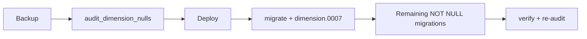

# Branch / Global Dimension 1 and `dimension_set` backfill (production)

This runbook is for **repeating** the branch and dimension set backfill and the follow-on NOT NULL migrations in production (or staging). It complements the high-level [DIMENSION_MIGRATION_PRODUCTION_GUIDE.md](DIMENSION_MIGRATION_PRODUCTION_GUIDE.md) and the API-oriented [branch_viewset_inventory.md](branch_viewset_inventory.md).

## Goal

- **Backfill** null `global_dimension_1` (and `global_dimension_2` when applicable) and, for models in the G1+set list, **`dimension_set_id`**, on all tables registered in `dimension/branch_dimension_registry.py`.
- **Then** run schema migrations that enforce NOT NULL and `PROTECT` on those fields where the product requires it.

For models with both G1 and a dimension set in the registry, resolution aims to set **both** `global_dimension_1_id` and `dimension_set_id` in the same backfill run.

## Prerequisites

- **Database backup** (and a tested restore path) before changing production data.
- A **maintenance or low-traffic window** if the dataset is large (bulk updates per table, audit rows written).
- **Setup data**: at least one `DimensionValue` for the tenant’s branch dimension, typically from `GeneralLedgerSetup.global_dimension_1` (or the `BRANCH` dimension fallback). The data migration `dimension.0007` calls the backfill with `allow_multiple_branch_values=True` so a legacy tenant with **multiple** branch values still migrates (first by code is used for the default). Interactive commands default to a stricter mode unless you pass the same flag where supported.

## Pre-flight (read-only)

Run the audit to capture null counts and sign off:

```bash
python manage.py audit_dimension_nulls
# Pilot one tenant:
python manage.py audit_dimension_nulls --schema=your_tenant_schema
# Optional CSV:
python manage.py audit_dimension_nulls --output-csv=audit_nulls.csv
```

Save the report for the release record.

## Deploy and migrate

1. **Deploy** the application version that includes `dimension.0007` and all dependent NOT NULL / alter migrations for your apps.
2. **Run migrations** so `dimension.0007_dimension_backfill_audit_and_data` executes per schema. It:
   - Creates `dimension_backfill_audit` (used for optional rollback of backfilled values).
   - Runs `RunPython` which calls `run_branch_dimension_backfill(allow_multiple_branch_values=True, write_audit=True)`.
   - If a tenant’s table is **behind the current models** (missing `global_dimension_1_id` or related columns), that model is **skipped** for that run so the migration can still commit. (Backfill uses one short database transaction per model so a bad table does not poison the rest on PostgreSQL.) Apply the relevant app migrations (e.g. `sales`), then run `backfill_branch_dimensions` again for that schema to fill those tables.
3. **Apply remaining migrations** in order (Django will resolve dependencies). App-specific NOT NULL steps should depend on `dimension.0007` where required.

**Multi-tenant (django-tenants):** run migrations for all tenant schemas the same way you do today, e.g.:

```bash
python manage.py migrate_schemas
# Or a single schema first:
# python manage.py migrate_schemas --schema=your_tenant_schema
```

Adjust flags (`--tenant`, environment, settings) to match [PRODUCTION_RUNBOOK.md](../PRODUCTION_RUNBOOK.md) and your deployment.

## Verify

```bash
python manage.py verify_branch_dimensions
```

Re-run the audit; you should see **no nulls** on the registered columns that were in scope (subject to the registry and model fields in that release):

```bash
python manage.py audit_dimension_nulls
```

## Re-run (idempotent)

If you need to backfill again **without** re-running the migration (e.g. new rows or a one-off after deploy):

```bash
python manage.py backfill_branch_dimensions
```

If **`dimension_backfill_audit` does not exist** in that tenant schema yet (`dimension.0007` not applied), either run migrations for that tenant first, or run once without audit (no rollback from this run):

```bash
python manage.py backfill_branch_dimensions --allow-multiple-branch-values --schema=YOUR_SCHEMA --no-audit
```

Options depend on the command implementation (e.g. `allow_multiple_branch_values` if exposed). The core logic in `dimension/backfill.py` is idempotent for typical null-filling.

## Rollback

- **Schema migration rollback** of `dimension.0007` runs `reverse_backfill` in the migration, which calls `reverse_branch_dimension_backfill()` in `dimension/backfill.py` and restores prior FK values from `dimension_backfill_audit` **for rows that were audited**.

**Important:** Rollback is only as complete as the audit table; if the audit rows were removed or the table was truncated, the reverse path cannot restore old values. Treat production rollback as rare and test on a copy first.

## End-to-end flow



## Key code references

| Piece | Location |
|-------|----------|
| Registry (which models get G1 + `dimension_set`) | `dimension/branch_dimension_registry.py` |
| Backfill and audit / reverse | `dimension/backfill.py` |
| Default branch + `DimensionSet` resolution | `dimension/utils.py` — `resolve_default_branch_for_tenant` |
| Data migration | `dimension/migrations/0007_dimension_backfill_audit_and_data.py` |

## Troubleshooting

| Symptom | What to check |
|--------|----------------|
| `Could not build DimensionSet for backfill` | `GeneralLedgerSetup`, branch `Dimension` / `DimensionValue`, and that `resolve_default_branch_for_tenant` can build or get-or-create a set (see `dimension/utils.py`). |
| NOT NULL fails after backfill | Re-run `audit_dimension_nulls` and `backfill_branch_dimensions` on the failing schema; confirm registry includes that model. |
| `Multiple branch DimensionValue` (command without allow-multiple) | Align tenant data to a single value or use the migration path that allows multiple (as in `0007`). |
